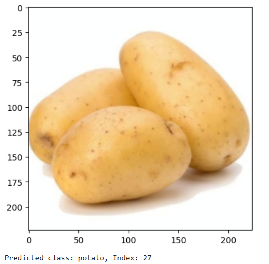

# Fruits & Vegetables Image Classification using ResNet and PyTorch

## Project Overview  
This project implements a deep learning model to classify images of **fruits and vegetables** using **transfer learning** with a **pre-trained ResNet model**. The dataset is sourced from **Kaggle**, and the model is trained and validated using PyTorch. Finally, the model is tested with an image **outside the dataset** to evaluate real-world performance.



---

## Technologies Used  
- **Python**
- **PyTorch (Torchvision, Torch)**
- **ResNet-18** (Pre-trained on ImageNet)
- **Kaggle Fruits & Vegetables Dataset**
- **Jupyter Notebook**

---

## Dataset  
The dataset is structured as follows:

```
data/
├── train/
│ ├── apple/
│ ├── banana/
│ └── ...
├── val/
│ └── ...
└── test/
    └── ...
```

- **train/**: Used to train the model  
- **val/**: Used to validate during training  
- **test/**: Used to evaluate final performance  

Each subfolder corresponds to a class label (e.g., apple, banana, carrot, etc.).

---

## Data Preprocessing and Augmentation

```python
from torchvision import transforms

data_transfomrs = {
    'train': transforms.Compose([
        transforms.RandomResizedCrop(224),                
        transforms.RandomHorizontalFlip(),                
        transforms.ToTensor(),                            
        transforms.Normalize([0.485, 0.456, 0.406],        
                             [0.229, 0.224, 0.225])        
    ]),
    'val': transforms.Compose([
        transforms.Resize(256),
        transforms.CenterCrop(224),
        transforms.ToTensor(),
        transforms.Normalize([0.485, 0.456, 0.406],
                             [0.229, 0.224, 0.225])
    ]),
    'test': transforms.Compose([
        transforms.Resize(256),
        transforms.CenterCrop(224),
        transforms.ToTensor(),
        transforms.Normalize([0.485, 0.456, 0.406],
                             [0.229, 0.224, 0.225])
    ])
}
```

### Explanation
- **Resizing/Cropping**: Ensures all input images are uniform (224×224).
- **Normalization**: Matches ImageNet preprocessing.
- **Augmentation (train only)**: Adds diversity to training data.

### Data Loading
```python
from torchvision import datasets
from torch.utils.data import DataLoader

image_datasets = {
    x: datasets.ImageFolder(os.path.join(data_dir, x), data_transfomrs[x]) 
    for x in ['train', 'val', 'test']
}
dataloaders = {
    x: DataLoader(image_datasets[x], batch_size=32, shuffle=True, num_workers=4) 
    for x in ['train', 'val', 'test']
}
class_names = image_datasets['train'].classes
```

### Device Setup
```python
device = "cuda" if torch.cuda.is_available() else "cpu"
```

### Model Setup: Transfer Learning with ResNet
```python
from torchvision import models
import torch.nn as nn

model_ft = models.resnet18(pretrained=True)

# Keep all layers trainable
num_ftrs = model_ft.fc.in_features
model_ft.fc = nn.Linear(num_ftrs, len(class_names))

model_ft = model_ft.to(device)
```

### Explanation
- A pretrained **ResNet18** is used as the base model.
- Unlike some transfer learning cases, **all layers are trainable**, not frozen.
- The final fully connected layer is replaced to match the number of fruit/vegetable classes.

### Loss Function and Optimizer
```python
import torch.optim as optim

criterion = nn.CrossEntropyLoss()
optimizer = optim.SGD(model_ft.parameters(), lr=0.001, momentum=0.9)
```

- All model parameters are optimized (not just the final layer).
- **CrossEntropyLoss** is used for multi-class classification.

### Training Loop
```python
def train_model(model, criterion, optimizer, num_epochs=25):
    ...
```

- Includes both **training** and **validation** phases.
- Tracks best accuracy and loss.
- Updates weights using the optimizer after each batch.

### Inference on New Image (Not in Dataset)
```python
from PIL import Image
from torchvision import transforms

def load_image(image_path):
    transform = transforms.Compose([
        transforms.Resize(256),
        transforms.CenterCrop(224),
        transforms.ToTensor(),
        transforms.Normalize([0.485, 0.456, 0.406],
                             [0.229, 0.224, 0.225])
    ])
    
    image = Image.open(image_path)
    image = transform(image).unsqueeze(0)
    return image
```

```python
# Load and predict
model_ft.eval()
img = load_image("path_to_external_image.jpg").to(device)
output = model_ft(img)
_, pred = torch.max(output, 1)

print("Predicted class:", class_names[pred.item()])
```

---

## Results
- The model achieved **accurate classification** of fruits and vegetables in the test set.
- It successfully **generalized** to a real-world image outside the dataset.
- Full training was performed (no frozen layers), allowing deeper adaptation.

---

## Summary
| Feature                   | Used |
|---------------------------|------|
| Pretrained CNN            | ✅   |
| Transfer Learning         | ✅   |
| Augmentation              | ✅   |
| Custom Inference          | ✅   |
